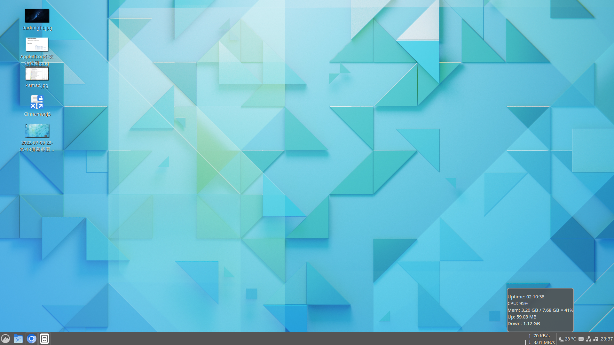

# CMUD_Cinnamon
Display net speed on Cinnamon taskbar, display uptime, CPU usage, memory usage, upload bytes, download bytes on pop window and tooltip.  

## Changelog
### V2.3 (2025-04-10)
Change font to Droid Sans Mono (0 without slash).  
`sudo pacman -S ttf-droid`
### V2.2 (2023-05-07)
Fix MemAvailable calculate error.
### V2.1 (2023-03-11)
Bytes unit 3 digit.
### V2.0 (2022-07-09)
Add mem line on left, cpu line on right.
### V1.0 (2022-07-07)
Display net speed on Cinnamon taskbar, display uptime, CPU usage, memory usage, download bytes, upload bytes on pop window and tooltip.
